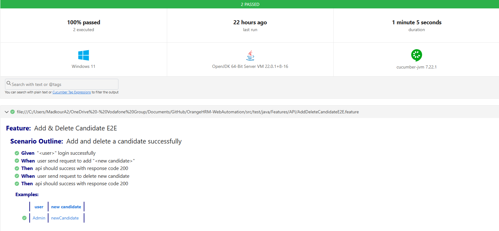
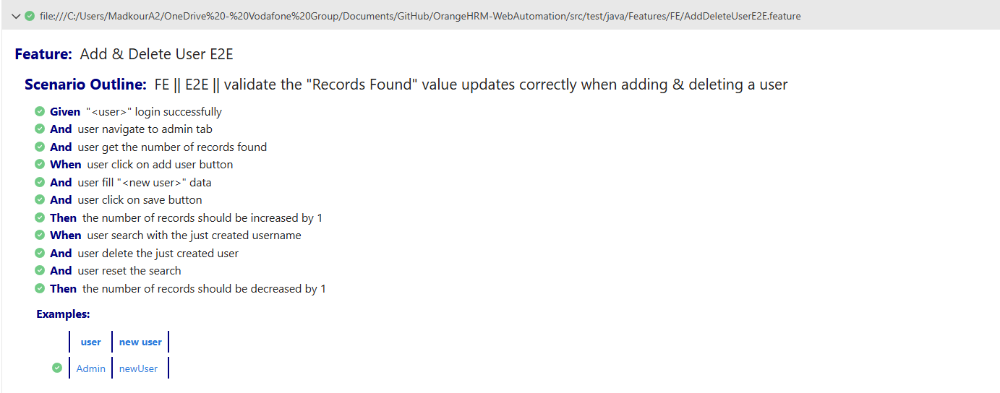

# OrangeHRM Automation Test Suite

This project contains automated tests for the [OrangeHRM demo site](https://opensource-demo.orangehrmlive.com/) using:
- **Selenium WebDriver** for UI (FE) testing
- **RestAssured** for API (BE) testing
- **Cucumber** for BDD-style scenarios
- **TestNG** for test execution
- **Maven** for dependency and test management
- **Cucumber HTML Reports**

🧪 Running the Project
- Option 1: Using Maven
To execute the full test suite and automatically open the Cucumber HTML report:
mvn clean verify
- Option 2: Using TestNG Runner
Alternatively, you can run tests using the TestNGRunner class

🧪 Features:

✅ Frontend (FE) Testing
: Add & delete user via UI

✅ Backend (API) Testing
: Add and delete candidate using "/api/v2/recruitment/candidates" endpoint
& Extracts session cookie from UI login to authenticate API requests

## Project Design:
- Modular Design Using Page Object Model Design Pattern (POM)
  -  Page classes contains:
      - Locators
      - Actions
      - Validations (Assertions) (in FE Cases only)
     
- Cucumber Feature Files & Step Definition Files
  - Feature Files contains The Test Cases in Gherkin Language (Given, When, Then)
  - Step Definition Files Link Feature Files with The Page Classes 

- Externalizing Test Data From JSON File

## 📊 Reporting:
This project uses Cucumber's built-in HTML report to display test execution results.

📍 Location: 
The report is generated at: target/cucumber-reports.html

🚀 Auto-Open Feature:
After running the tests using: mvn clean verify
the report will automatically open in your default browser — even if some test cases fail.

🧠 This is achieved by combining:
1- exec-maven-plugin to open the HTML file
2- maven-surefire-plugin with: <testFailureIgnore>true</testFailureIgnore>
to allow the build to continue and reach the verify phase (where the report is opened)

🖱️ You can also open the report manually by navigating to: target/cucumber-reports.html
## Test Report Screenshot

